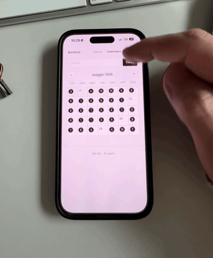

# Hermes Link Curator

A **link curator profile pack** for [Hermes Agent](https://github.com/NousResearch/hermes-agent) — turn any Hermes agent into a librarian. Send a URL, get it archived, tagged, summarized, and browsable in a fast Obsidian-style dashboard.

## Dashboard preview

[](assets/dashboard-preview.mp4)

The archive is just a local web app, so it works well on desktop and mobile: list view, calendar, search, tags, day pages, graph view, and JSON stats all read from the same markdown vault.

## What this is

- **2 skills** (`obsidian` + `link-curator-dashboard`) — drop into any Hermes profile
- **1 dashboard** — standalone FastAPI app, Obsidian-style web UI (port 8090)
- **1 SOUL template** — gives the agent a "librarian" personality (archive, don't summarize)

The agent receives links on Telegram, Discord, or anywhere else → fetches content → writes entries to a local markdown vault → the dashboard reads the vault and serves a search/tag/graph view.

## Requirements and platforms

Hermes Link Curator is designed for Unix-like environments:

- **macOS** — supported
- **Linux** — supported
- **Windows via WSL** — should work if Hermes works in your WSL environment
- **Windows native** — not currently supported by the installer

You need [Hermes Agent](https://github.com/NousResearch/hermes-agent), Python 3.10+, and a Bash-compatible shell. The dashboard itself is a standard FastAPI app, but the installer and profile paths assume `~/.hermes/...`.

## Install (30 seconds, agent-guided)

Send your Hermes agent a message like:

> *Install https://github.com/dodo-reach/hermes-link-curator — follow the AGENT_GUIDE.md.*

The agent will read `AGENT_GUIDE.md`, create a new profile, copy the pieces, and start the dashboard. You can then start archiving:

> *archive https://github.com/some/repo*

or use the dashboard at `http://localhost:8090`.

**Prefer the manual path?** Run `./install.sh` from this repo — it asks one question (profile name) and does the same thing.

## Where the dashboard lives

The installer copies the web app into your Hermes profile and starts it from:

```bash
~/.hermes/profiles/<profile-name>/dashboard/
```

By default it listens on:

```text
http://localhost:8090
```

That means it is exposed only on the machine running Hermes. The dashboard reads the vault at `~/.hermes/profiles/<profile-name>/vault/`, so every archived link appears there as markdown and in the web UI.

You can change the port when installing, or later by running:

```bash
cd ~/.hermes/profiles/<profile-name>/dashboard
./start.sh 8091
```

The dashboard binds to `127.0.0.1` by default. To make it reachable from your iPhone on the same private network, start it with:

```bash
cd ~/.hermes/profiles/<profile-name>/dashboard
ARCHIVE_HOST=0.0.0.0 ./start.sh 8090
```

Then open `http://<your-mac-ip>:8090` from Safari on iPhone.

## Use it like an iPhone app

Once the dashboard is reachable from your iPhone:

1. Open the dashboard URL in Safari.
2. Tap the Share button.
3. Tap **Add to Home Screen**.
4. Name it `Archive` or `Hermes Links`.

From then on, you can launch the archive from your Home Screen like a small private app.

## Access from anywhere with Tailscale

For access outside your home network, use [Tailscale](https://tailscale.com/) instead of exposing the dashboard to the public internet:

1. Install Tailscale on the Mac running Hermes and on your iPhone.
2. Sign both devices into the same tailnet.
3. Start the dashboard with `ARCHIVE_HOST=0.0.0.0`.
4. On iPhone, open `http://<mac-tailscale-name>:8090` or `http://<mac-tailscale-ip>:8090`.
5. Add that page to the Home Screen from Safari.

The dashboard does not include authentication, so keep it behind localhost, your LAN, or Tailscale. Do not publish it directly to the open internet.

## Repo layout

```
hermes-link-curator/
├── README.md                          # you are here
├── AGENT_GUIDE.md                     # instructions for the agent
├── install.sh                         # self-service installer
├── SOUL.template.md                   # paste into your profile's SOUL.md
├── skill-obsidian/                    # the save-link skill
├── skill-link-curator-dashboard/      # the dashboard maintenance skill
└── dashboard/                         # standalone FastAPI web app
```

## Architecture

Everything lives under `~/.hermes/profiles/<profile-name>/`. Path auto-discovery — no env vars to set, no config files to edit:

```
~/.hermes/profiles/link-curator/
├── SOUL.md                            # personality + triggers
├── vault/                             # the archive (auto-created on first save)
│   ├── INDEX.md                       # master list, newest first
│   └── YYYY-MM-DD.md                  # daily notes
├── skills/note-taking/
│   ├── obsidian/                      # the save workflow
│   └── link-curator-dashboard/        # dashboard maintenance
└── dashboard/                         # the FastAPI web app
    ├── main.py
    ├── archive.py                     # vault parser
    ├── validate.py                    # integrity checker
    └── start.sh                       # launcher
```

The dashboard reads the vault and exposes: list, calendar, search, tag pages, day pages, a D3 force-directed tag graph, and a JSON stats endpoint.

## Optional upgrades

The base install gets you archiving. Two more steps are documented in `AGENT_GUIDE.md`:

- **Fetch context from difficult links** — add a browser-based fetcher and the Playwright MCP server for sites that need JavaScript rendering or an existing browser session
- **Send links from messaging apps** — add a Telegram/Discord/Slack gateway and forward URLs to the link-curator agent

## Acknowledgments

Built by [dodo-reach](https://github.com/dodo-reach) as a personal system, packaged for the Hermes community. Powered by [Hermes Agent](https://github.com/NousResearch/hermes-agent) by Nous Research.

## License

MIT
